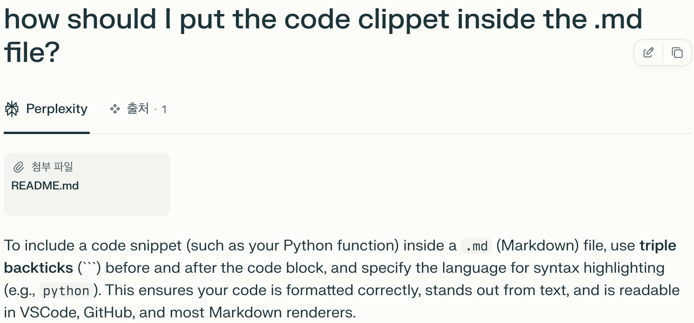
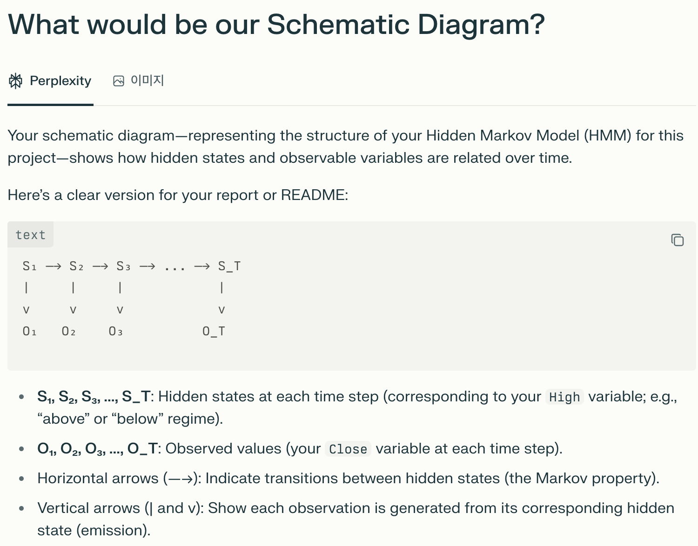

# CSE150A Group Project Milestone 4: Final Model

## 1. Dataset

### 1-1. Describe your Data
- [Link to Data Set](https://www.kaggle.com/datasets/meharshanali/amazon-stocks-2025)
- **Primary Features For Our Use:**
  - High (Highest price of Amazon for that day)
  - Close (Closing price of Amazon for that day)
- **Task:**
  - We are trying to find how volitile Amazon has been since its birth based one how many times it changed between Bullish and Bearish.
- **Relevance:**
  - This data is relevent to probabilistic modeling because we are using it to create a Markov Model and performing Viterbi algorithm to find the most likely sequence of our Hidden State.
- **Preprocessing:**
  - Filter our dataset to only only include the necessary columns which is Close and Difference.
  - We one hot encoded close to 0(Bearish) 1(Bullish) if Close is greater than the Open price of that day. Difference is one hot encoded to 0 (Close-Open<0) and 1(Close-Open>0). 

### 1-2. A couple things to consider:
- **How big is the dataset? Is it reasonably processable?**
  - The original dataset has 8 features and 6987 observations
  - This size can be easily managed and processed using standard libraries such as pandas, NumPy, and scikit-learn.
- **Where is the data from, and is it reliable?**
  - Origin: Kaggle
  - The dataset is indeed reliable as it uses accuracte information from Yahoo Finance
- **Is your data categorical or continuous, or both?**
  - Before precrocessing the majority of our features are continuous however after one hot encoding they have become categorical

## 2. PEAS / Agent Analysis
### 2-1. Describe your agent in terms of PEAS and give a background of your task at hand.
- **Performance measure:**
  - Accuracy: How accurate our model is in perdicting whether our Hidden state is a 0 or 1 (below the overall average for High price or lower than the overall average for High price ).
- **Environment:**  
  - Stock Market: The historical price movement environment of Amazon shares.
  - Financial Firm: A practical setting where an analyst or automated tool would apply this model to real-world data to inform decisions.
- **Actuators:**  
  - Screen Display: Outputs model predictions, inferred market regimes, or visual analytics to the user (e.g., via report, terminal, or dashboard).
- **Sensors:**  
  - CSV File Reader: Loads and reads historical stock data (e.g., price, volume, etc.)
  - Keyboard (Entry of symptoms, findings, patient answers)
### 2-2. What problem are you solving? Why does probabilistic modeling make sense to tackle this problem?
  - The true market regime (bullish or bearish) is a hidden variable—we can observe prices, but not the underlying “state of the market.”

  - Stock price changes are noisy and stochastic; the same observed pattern might result from multiple hidden causes.

  - A Hidden Markov Model (HMM) allows us to model the uncertainty in inferring these regimes from the sequence of observations.

  - HMMs let us compute the most probable sequence of underlying states (using the Viterbi algorithm) and provide confidence estimates for these inferences.

  - Probabilistic modeling is well-suited for this problem because it can quantify uncertainty, capture transitions between regimes, and leverage both the persistence of states and the variability in observations.
### 2-3. Give an overview of related work for approaches to solve this problem. What models could you potentially use, or has been used before to tackle this type of problem? What are the other approaches' benefits or drawbacks?
  - **Related Work:**  
    - Hidden Markov Models (HMMs): Frequently used in finance to model regime changes, e.g., volatility shifts, "bull" vs. "bear" markets, or jumps in statistical properties of price series.
      - Strengths: Makes explicit the concept of hidden regimes; fast, interpretable; good for time series with regime persistence.
      - Drawbacks: Usually assumes discrete, finite number of regimes and that state transitions are Markovian.

    - Change-point Detection Methods: Statistical techniques to find points where the statistical properties of a sequence change.
      - Strengths: Good for detecting abrupt transitions.
      - Drawbacks: Often don't model state persistence or provide regime probabilities for every time point.

    - Switching Autoregressive Models / Markov-Switching Models: Blend AR time series models with hidden state switching; similar to HMMs but can explicitly handle autocorrelation in returns.
      - Strengths: More flexible for financial data.
      - Drawbacks: Can be complex to fit, less interpretable.

    - Machine Learning Approaches (e.g., LSTM, SVM): Used for volatility forecasting, but often require more data and can lack interpretability in terms of "regimes."
      - Strengths: Can model complex patterns, nonlinearities.
      - Drawbacks: Not directly probabilistic for regime inference; may need lots of data; often opaque.

## 3. Agent Setup, Data Preprocessing, Training Setup

### 3-1. Give an exploration of your dataset, and highlight which variables are important. Give a brief overview of each variable and its role in your agent/model.

Our dataset includes the following key variables:

| Variable | Type              | Purpose in Model      | Description                                                            |
|----------|-------------------|----------------------|------------------------------------------------------------------------|
| High     | categorical (0/1) | Hidden state (S_t)   | Latent market regime at each time step (e.g., "above" or "below" a threshold) |
| Close    | categorical (0/1) | Observation (O_t)    | Observed market signal at each time step                               |

Schematic Diagram:

<pre>
S₁ —-> S₂ —-> S₃ —-> ... —-> S_T
|      |      |               |
v      v      v               v
 O₁    O₂     O₃             O_T
</pre>

- S = hidden state ("High"), O = observation ("Close") 

- High is the hidden state that evolves over time (e.g., representing a price regime: "below"/"above").

- Close is the observable signal generated by the hidden state.

### 3-2. Describe in detail how your variables interact with each other, and if your model fits a particular structure, explain why you chose that structure to model your agent. If it does not, further elaborate on why you chose that model based on the variables.

- At each time step t, the hidden state High_t depends only on High_{t-1} (Markov property).

- The observation Close_t depends only on High_t.

- The structure is a standard Hidden Markov Model (HMM), chosen because there’s an underlying regime that influences observations, temporal dependencies matter, and HMMs provide an interpretable, probabilistic framework for such sequential data.

### 3-3. Describe your process for calculating parameters in your model. That is, if you wish to find the CPTs, provide formulas as to how you computed them. If you used algorithms in class, just mention them.

  - We have to guess when the market(Amazon stock price) is in a high or low regime.
  - We only see the prices, which are influenced by whether the market is high or low.
   

  - The market tends to stay in the same regime for a while, but sometimes switches—and the model is built to capture just that pattern. This applies to Markov property where it reflects realistic persistence and switching between regimes.
  - CPTS:

$$P(A = a) = \frac{\mathbb{E}[\text{count}(A = a)]}{T}$$

$$P(X = x | \text{Pa}(X) = \mathbf{p}) = \frac{\mathbb{E}[\text{count}(X = x, \text{Pa}(X) = \mathbf{p})]}{\mathbb{E}[\text{count}(\text{Pa}(X) = \mathbf{p})]}$$

$$P(B = 1 | A = 0) = \frac{\mathbb{E}[\text{count}(B = 1, A = 0)]}{\mathbb{E}[\text{count}(A = 0)]} \quad , \quad P(B = 0 | A = 0) = \frac{\mathbb{E}[\text{count}(B = 0, A = 0)]}{\mathbb{E}[\text{count}(A = 0)]}$$

### 3-4. Library Usage, References
  - We implemented training and inference routines in pure Python and did not use external libraries for HMMs.
The librarys we did use were :
    - Numpy:
      The purpose of this library is to perform operations on arrays and matrices,
      we used this to manipulate or matrices and values.
  
    - Pandas:
     The purpose is to manipulate and analyze data frames particulary rows and         columns. This is percisely what we used it for to import our data and             manipulate it in a way that was useful and readable.

    - Scikit-learn:
      This library is used to evaluate models. We used this to check the efficentcy     of our model.
    


## 4. Train your model!

Below is the source code for the Viterbi algorithm used to decode the most probable sequence of hidden states in our HMM:

```python
def viterbi_algorithm(obs, states, start_prob, trans_prob, emit_prob):
    """
    obs: list or array of observations (as integer indices)
    states: list of state names or values
    start_prob: numpy array of shape (N,)
    trans_prob: numpy array of shape (N,N)
    emit_prob: numpy array of shape (N,M)

    Returns:
        best_path: list of most likely states (by label, not index)
        delta: np.ndarray of shape (T, N), max probability at each state, each t
        psi: np.ndarray of shape (T, N), backpointer for optimal path
    """
    N = len(states)
    T = len(obs)

    delta = np.zeros((T, N))
    psi = np.zeros((T, N), dtype=int)

    # Initialization
    delta[0, :] = start_prob * emit_prob[:, obs[0]]
    psi[0, :] = 0

    # Recursion
    for t in range(1, T):
        for j in range(N):
            seq_probs = delta[t-1, :] * trans_prob[:, j]
            psi[t, j] = np.argmax(seq_probs)
            delta[t, j] = np.max(seq_probs) * emit_prob[j, obs[t]]

    # Termination
    best_last_state = np.argmax(delta[T-1, :])
    best_path_idx = np.zeros(T, dtype=int)
    best_path_idx[T-1] = best_last_state

    # Path backtracking
    for t in range(T-2, -1, -1):
        best_path_idx[t] = psi[t+1, best_path_idx[t+1]]

    # Convert indices to state labels
    best_path = [states[i] for i in best_path_idx]

    return best_path, delta, psi
```
## 5. Conclusion/Results
### Results
- **Accuracy**: 0.5069 
- **Precision**: 0.5758
- **Recall**: 0.0544  
- **F1 Score**: 0.0993  

### Confusion Matrix

|               | Predicted: No | Predicted: Yes |
|---------------|---------------|----------------|
| Actual: No    | 3352            | 140             |
| Actual: Yes   | 3305            | 190            |

### Interpretation
Looking at the accuracy we see that the model is as good as randomly guessing. Looking at precision we can see that our model rarely predicts a bullish outcome and when it does it is right about 57% of the time. Looking at Recall we can see that our model rarely predicts bullish mostlikey do to the fact that we have more 0's than 1's. Our F1 score is also very poor which indicates there is huge imbalance of between 0 and 1. 
### Improvements 
Some improvements that we could make to have a better model is use a different columns for our oberservation layer of our MM. Another thing that we can do is try implementing a Forward-Backward algorithm to find the most likely hidden state. 


## 6. Additional Notes
### imported libraries: 
-sklearn.metrics: used it to provide functions to evaluate our model 

### 6-1. Citations

dbell3. (n.d.). DBELL3/CSE-150-proj-1: Project 1. GitHub. https://github.com/dbell3/CSE-150-Proj-1 
3.4. metrics and scoring: Quantifying the quality of predictions. scikit. (n.d.). https://scikit-learn.org/stable/modules/model_evaluation.html 
https://numpy.org/doc/
https://scikit-learn.org/0.21/documentation.html
https://pandas.pydata.org/docs/

### 6-2. Generative AI Usage
We used generative AI platforms to assist throughout our project:

  - ChatGPT (chat.openai.com):
    - Debugging Python code.
    - Clarifying function logic.
    - Interpreting model results and performance.
    - Drafting documentation and Markdown formatting.
  - Perplexity AI (perplexity.ai):
    - We used Perplexity AI to ask specific questions about correct Markdown syntax and grammar while writing our documentation.
    - Additionally, we used it to generate a diagram image illustrating our model structure.

  Below are the examples:
  
  
  
